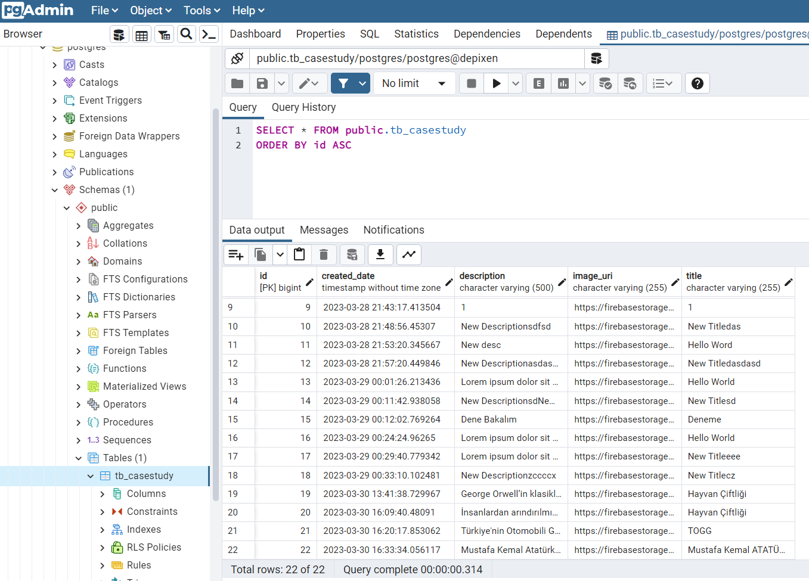
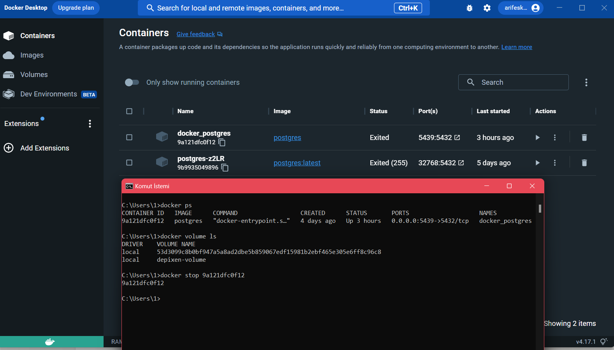
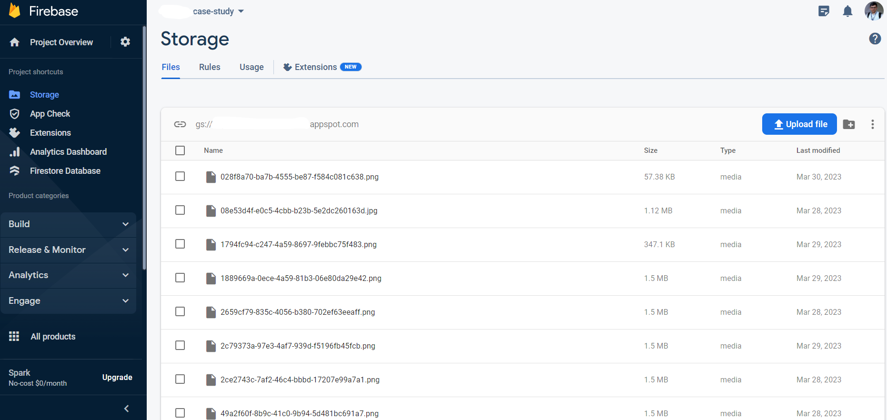
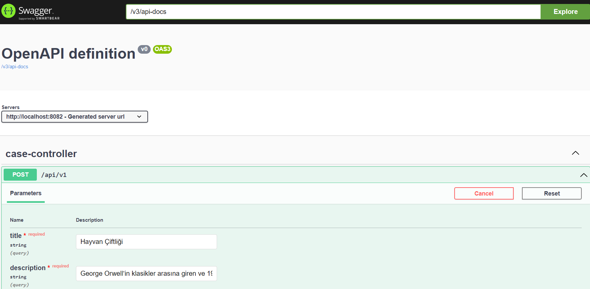

# Backend - Java & Spring_Boot

```bash
What's going on in the backend of this app:


- Table created in database using Entity and with Hibernate
- Docker desktop is opened first, then docker postgres container is run
- For image files, buckets and credentials are created via firebase console, then they are integrated on spring boot
- The application is tested by sending open api requests via swagger in the project

```

### images

- `PostgreSQL - pgAdmin` :



- `Docker` :



- `Firebase` :



- `Swagger - Open API` :


