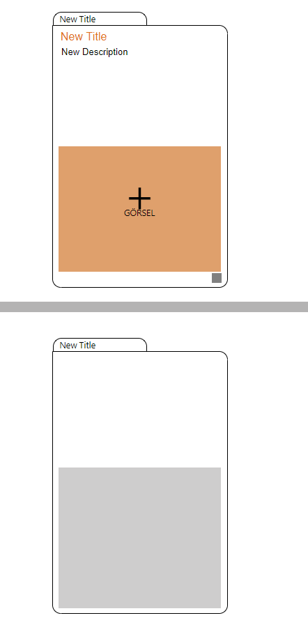
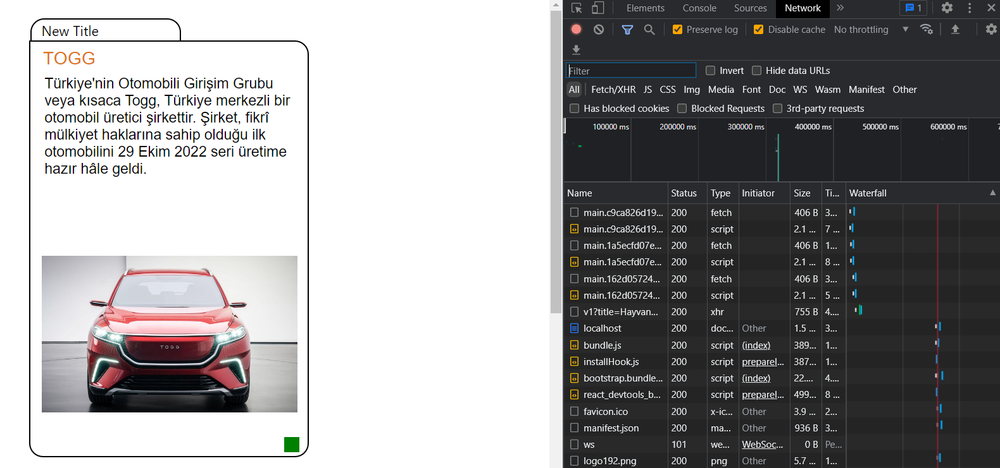
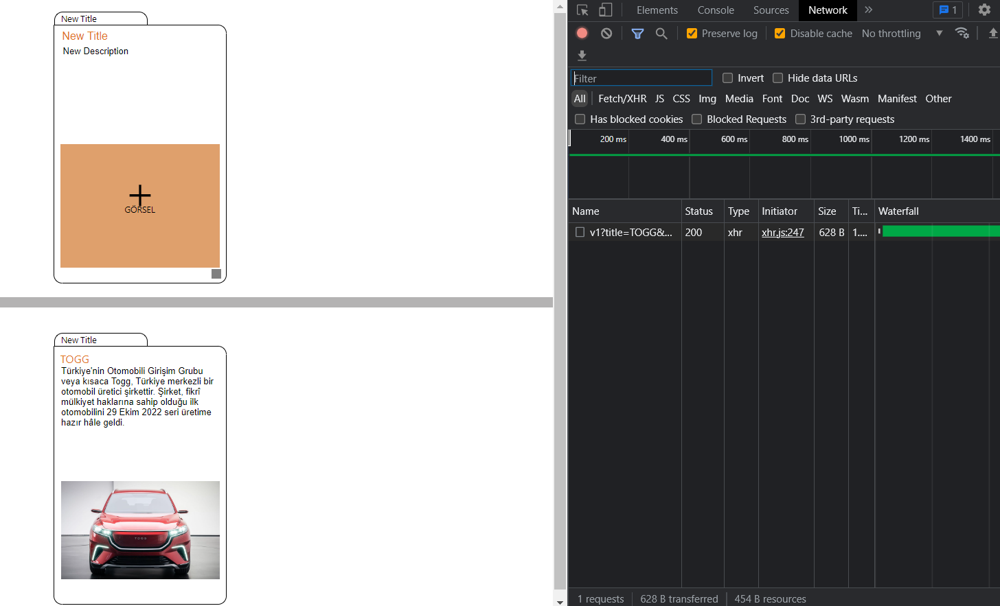
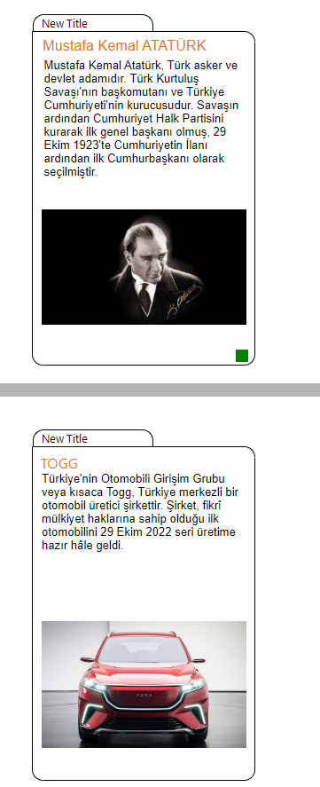
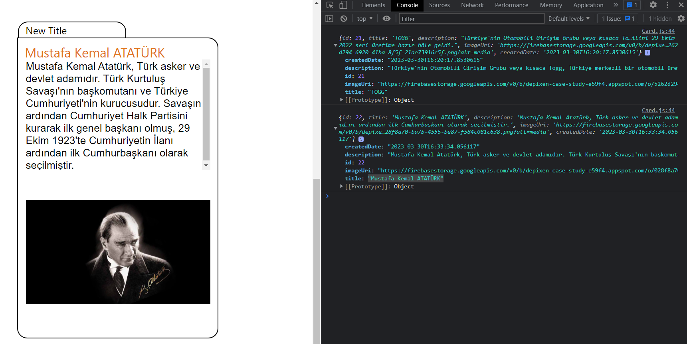
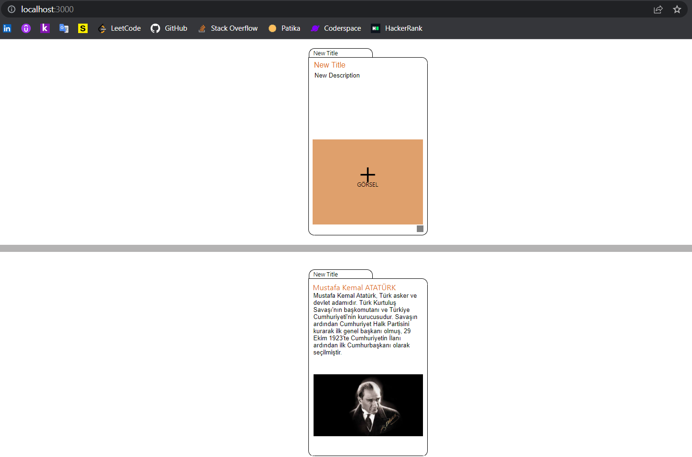

# Frontend - HTML / CSS / Javascript / React

```bash
What's going on in the frontend of this app:


- Desired visual design was done with html and css
- React project created with necessary npm commands
- Html codes are integrated into React as a component
- Communication with backend and api with axios library

```

### images

- `HTML - CSS` :



- `Javascript` :



- `React - Axios` :



<br>



<br>



<br>


